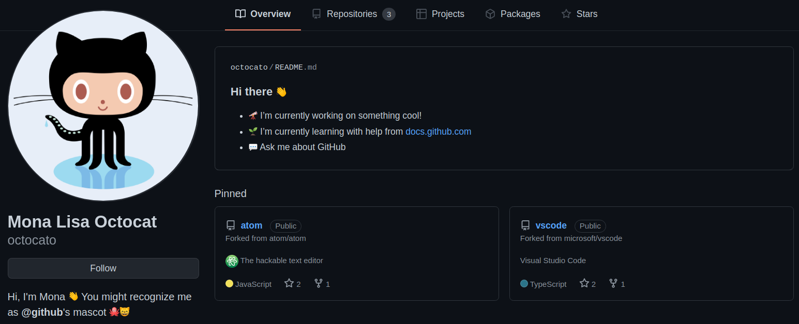

## Создаем README.md профиля

Для того чтобы создать README-файл, который будет отображаться в профиле, необходимо создать новый публичный репозиторий с названием, полностью повторяющим никнейм пользователя. Также важно не забыть поставить галочку в поле, предлагающем вместе с репозиторием создать и README.md. Во время настройки репозитория нас поздравит Октокот и сообщит о том, что только что мы создали особенный репозиторий и его содержимое будет отображаться на странице профиля. GitHub автоматически сделает базовый шаблон, в который можно вписать информацию о себе, а можно не вписывать и сделать что-то чуть более интересное.

 
